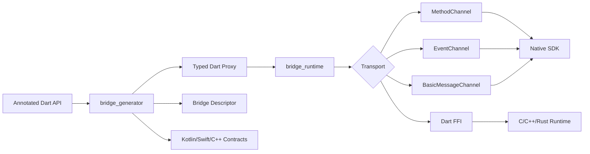

# NativeFlow Bridge

NativeFlow Bridge is a modular Flutter-native interoperability framework for
building type-safe, generated bridges between Dart and Android, iOS, macOS,
Windows, Linux, and FFI-based native runtimes.

Maintained by Anurag at
[Anu-Code07/flutter-native-bridge](https://github.com/Anu-Code07/flutter-native-bridge).

It is designed as a modern replacement for hand-written `MethodChannel`,
`EventChannel`, and `BasicMessageChannel` boilerplate:

```dart
@Bridge(channel: 'payments')
abstract class PaymentBridge {
  Future<PaymentResult> pay(PaymentRequest request);

  Stream<PaymentEvent> events();

  Future<void> cancelPayment();
}
```

The generator and runtime produce:

- typed Dart clients
- platform channel descriptors
- serializer contracts
- event stream bindings
- typed bridge exceptions
- native runtime contracts for Kotlin, Swift, C++, and FFI integrations

## Monorepo layout

```text
packages/
  bridge_annotations/  Public annotations consumed by source_gen.
  bridge_core/         Shared descriptors, codecs, exceptions, and serializers.
  bridge_generator/    build_runner/source_gen code-generation engine.
  bridge_runtime/      Flutter channel runtime and stream management.
  bridge_android/      Kotlin runtime primitives and Flutter plugin shell.
  bridge_ios/          Swift runtime primitives and Flutter plugin shell.
  bridge_macos/        macOS Swift plugin shell.
  bridge_windows/      Windows C++ plugin shell.
  bridge_linux/        Linux C++ plugin shell.
  bridge_ffi/          Dart FFI memory/execution primitives.
  bridge_devtools/     DevTools extension foundation.
examples/              Production-style bridge examples.
docs/                  Architecture, generator, FFI, and security guides.
website/               Static developer website starter.
```

## Architecture



## Packages

The packages intentionally separate compile-time APIs from runtime behavior:

- `nativeflow_bridge_annotations` has no Flutter dependency and is safe for
  domain packages.
- `nativeflow_bridge_generator` depends on `analyzer`, `build`, and
  `source_gen` and emits generated Dart plus native contract metadata.
- `nativeflow_bridge_core` owns transport-neutral descriptors, codec contracts,
  serializer interfaces, and typed exceptions.
- `nativeflow_bridge_runtime` owns Flutter channel execution, event
  multiplexing, buffering, cancellation, and lifecycle-aware registration.
- Platform packages provide native plugin shells and runtime primitives that can
  be consumed by generated Kotlin, Swift, and C++ code.

## Developer workflow

```bash
dart pub global activate melos
melos bootstrap
melos run analyze
melos run test
melos run format
```

> This repository requires a Flutter/Dart SDK on the machine running the
> commands.

See [PUBLISHING.md](PUBLISHING.md) for pub.dev dry-run commands and package
publish order.

## Status

This is the initial SDK foundation. It establishes package boundaries, public
APIs, generator flow, runtime abstractions, native runtime shells, examples,
documentation, and CI so future work can fill out platform-specific codegen and
integration tests without changing the architecture.
