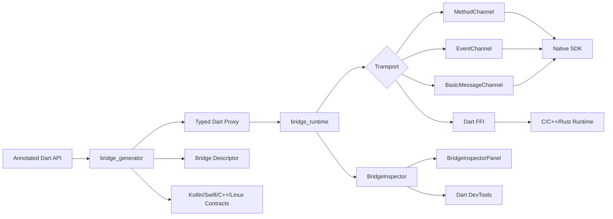

# NativeFlow Bridge

NativeFlow Bridge is a modular Flutter-native interoperability framework for
building type-safe, generated bridges between Dart and Android, iOS, macOS,
Windows, Linux, and FFI-based native runtimes — with a first-class DevTools
inspector for every bridge call.

Maintained by Anurag at
[Anu-Code07/flutter-native-bridge](https://github.com/Anu-Code07/flutter-native-bridge).

It is designed as a modern, **production** replacement for hand-written
`MethodChannel`, `EventChannel`, and `BasicMessageChannel` boilerplate:

```dart
@Bridge(channel: 'payments', codec: BridgeCodec.json)
abstract class PaymentBridge {
  Future<PaymentResult> pay(PaymentRequest request);

  @BridgeEvent(name: 'events', replay: 1, bufferSize: 64)
  Stream<PaymentEvent> events();

  @BridgeMethod(timeout: Duration(seconds: 30))
  Future<void> cancelPayment();
}

@BridgeError('payment_cancelled')
final class PaymentCancelledException extends BridgeException { /* … */ }
```

The generator and runtime produce:

- typed Dart clients with timeouts, codec, and reconnect policy honoured
- platform channel descriptors with versioning + collision detection
- serializer + payload redactor contracts
- event stream bindings with `replay` / `bufferSize` enforced
- typed bridge exceptions wired through `@BridgeError(code)`
- native runtime contracts for Kotlin, Swift, Windows C++, Linux C, and FFI
- a live in-process inspector + DevTools service extensions

## Monorepo layout

```text
packages/
  nativeflow_bridge/    Public umbrella package exported from one import.
  bridge_annotations/  Public annotations consumed by source_gen.
  bridge_core/         Shared descriptors, codecs, exceptions, and serializers.
  bridge_generator/    build_runner/source_gen code-generation engine.
  bridge_runtime/      Flutter channel runtime and stream management.
  bridge_android/      Kotlin runtime primitives and Flutter plugin shell.
  bridge_ios/          Swift runtime primitives and Flutter plugin shell.
  bridge_macos/        macOS Swift plugin shell.
  bridge_windows/      Windows C++ plugin shell.
  bridge_linux/        Linux C++ plugin shell.
  bridge_ffi/          Dart FFI memory/execution primitives.
  bridge_devtools/     DevTools extension foundation.
examples/              Production-style bridge examples (payment, FFI, KYC).
docs/                  Architecture, generator, FFI, DevTools, and security guides.
website/               Static developer website starter.
```

## Architecture



## Package (pub.dev)

Only **`nativeflow_bridge`** is published to pub.dev. It contains annotations,
code generation, runtime, FFI, DevTools, and all platform native plugins.

**Recommended import:**

```dart
import 'package:nativeflow_bridge/nativeflow_bridge.dart';
```

The `packages/bridge_*` folders are monorepo-only compatibility shims
(`publish_to: none`) for local development.

## Developer workflow

```bash
dart pub global activate melos
flutter pub get
melos run analyze
melos run test
melos run test:flutter
melos run format
melos run generate:diff
melos run pub:dry-run
```

Supports **Flutter 3.44+** (Dart 3.7+).

See [PUBLISHING.md](PUBLISHING.md) for pub.dev dry-run and publish commands.

See [docs/examples.md](docs/examples.md) for payment, BLE, FFI, and KYC
example patterns (also in the
[`nativeflow_bridge` README](packages/nativeflow_bridge/README.md) shown on
pub.dev).

## DevTools

Every method, message, event, and error crossing the bridge is recorded by
the in-process `BridgeInspector`. Drop the panel into a debug route:

```dart
import 'package:nativeflow_bridge/devtools.dart';

Navigator.of(context).push(MaterialPageRoute<void>(
  builder: (_) => const Scaffold(body: BridgeInspectorPanel()),
));
```

You get a live timeline, per-channel latency stats, an error feed, and JSON
export. The same data is available to Dart DevTools via
`ext.nativeflow_bridge.*` service extensions registered by
`BridgeDevToolsService.register()`. All telemetry is metadata-first; raw
payload previews are opt-in and pass through `BridgePayloadRedactor`.

## Status

NativeFlow Bridge **1.0.0** is production-ready: typed errors, codec/
transport/replay wiring, multi-platform runtime parity, DevTools-grade
inspector, ProGuard / consumer rules for Android, and a release pipeline.
See [`CHANGELOG.md`](packages/nativeflow_bridge/CHANGELOG.md).

## Security

See [`SECURITY.md`](SECURITY.md) for our hardening guarantees,
vulnerability-reporting process, and per-platform defaults.
