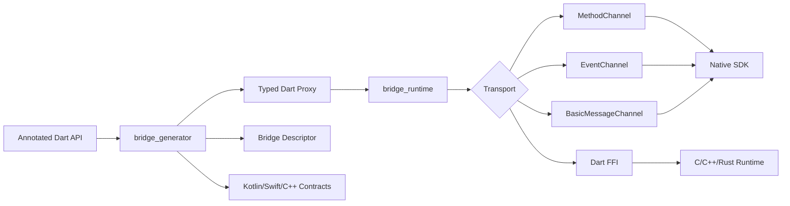

# NativeFlow Bridge

NativeFlow Bridge is a modular Flutter-native interoperability framework for
building type-safe, generated bridges between Dart and Android, iOS, macOS,
Windows, Linux, and FFI-based native runtimes.

Maintained by Anurag at
[Anu-Code07/flutter-native-bridge](https://github.com/Anu-Code07/flutter-native-bridge).

It is designed as a modern replacement for hand-written `MethodChannel`,
`EventChannel`, and `BasicMessageChannel` boilerplate:

```dart
@Bridge(channel: 'payments')
abstract class PaymentBridge {
  Future<PaymentResult> pay(PaymentRequest request);

  Stream<PaymentEvent> events();

  Future<void> cancelPayment();
}
```

The generator and runtime produce:

- typed Dart clients
- platform channel descriptors
- serializer contracts
- event stream bindings
- typed bridge exceptions
- native runtime contracts for Kotlin, Swift, C++, and FFI integrations

## Monorepo layout

```text
packages/
  nativeflow_bridge/    Public umbrella package exported from one import.
  bridge_annotations/  Public annotations consumed by source_gen.
  bridge_core/         Shared descriptors, codecs, exceptions, and serializers.
  bridge_generator/    build_runner/source_gen code-generation engine.
  bridge_runtime/      Flutter channel runtime and stream management.
  bridge_android/      Kotlin runtime primitives and Flutter plugin shell.
  bridge_ios/          Swift runtime primitives and Flutter plugin shell.
  bridge_macos/        macOS Swift plugin shell.
  bridge_windows/      Windows C++ plugin shell.
  bridge_linux/        Linux C++ plugin shell.
  bridge_ffi/          Dart FFI memory/execution primitives.
  bridge_devtools/     DevTools extension foundation.
examples/              Production-style bridge examples.
docs/                  Architecture, generator, FFI, and security guides.
website/               Static developer website starter.
```

## Architecture



## Package (pub.dev)

Only **`nativeflow_bridge`** is published to pub.dev. It contains annotations,
code generation, runtime, FFI, DevTools, and all platform native plugins.

**Recommended import:**

```dart
import 'package:nativeflow_bridge/nativeflow_bridge.dart';
```

**Optional granular imports** (same package, no extra dependencies):

```dart
import 'package:nativeflow_bridge/annotations.dart';
import 'package:nativeflow_bridge/core.dart';
import 'package:nativeflow_bridge/runtime.dart';
import 'package:nativeflow_bridge/ffi.dart';
import 'package:nativeflow_bridge/builder.dart'; // build_runner
```

The `packages/bridge_*` folders are monorepo-only compatibility shims
(`publish_to: none`) for local development.

## Developer workflow

```bash
dart pub global activate melos
melos bootstrap
melos run analyze
melos run test
melos run format
```

> Supports **Flutter 3.27+** (Dart 3.6+). **Recommended:** Flutter **3.44+** for latest
> `analyzer` 13.x. Older stable releases resolve `analyzer` 10.0.1 automatically.

See [PUBLISHING.md](PUBLISHING.md) for pub.dev dry-run commands and package
publish order.

See [docs/examples.md](docs/examples.md) for payment, BLE, FFI, and KYC example
patterns (also in the [`nativeflow_bridge` README](packages/nativeflow_bridge/README.md)
shown on pub.dev).

## Status (0.1.0 — experimental)

**Version 0.1.0 is an early, experimental release.** The public API, generated
output, and native contracts may change in minor releases until 1.0.0.

What works today:

- Package boundaries, annotations, core descriptors, runtime channel APIs
- `build_runner` code generation for Dart clients and contract metadata
- Platform plugin shells (Android, iOS, macOS, Windows, Linux) and FFI helpers

Not yet production-complete (see [docs/roadmap.md](docs/roadmap.md)):

- Writing generated Kotlin/Swift/C++ into native source sets
- Broad integration test coverage across platforms
- Binary/protobuf codecs and enterprise transport extensions

Use only if you accept breaking changes; pin exact versions in `pubspec.yaml`.
