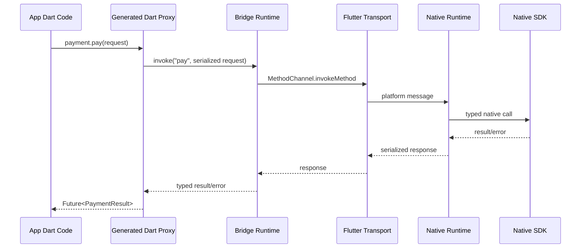

# NativeFlow Bridge architecture

NativeFlow Bridge uses a split compile-time/runtime architecture.

## Package responsibilities

- `bridge_annotations`: compile-time-only marker APIs.
- `bridge_generator`: analyzer/source_gen implementation and native contract
  emitters.
- `bridge_core`: descriptors, serializer contracts, typed exceptions, and
  transport-neutral metadata.
- `bridge_runtime`: Flutter channel orchestration, stream multiplexing, and
  platform error mapping.
- `bridge_ffi`: dynamic library lookup, memory scope ownership, and isolate
  execution.
- Platform packages: native registration shells and runtime primitives.
- `bridge_devtools`: event timeline and inspection model for DevTools.

## Threading model

| Platform | Default method execution | Stream execution | Background work |
| --- | --- | --- | --- |
| Dart | UI isolate call site | broadcast stream | `Isolate.run` through FFI executor |
| Android | Main dispatcher registration | `EventChannel` sink | coroutines/worker dispatchers |
| iOS/macOS | Swift `Task` bridge | `FlutterStreamHandler` | Swift concurrency |
| Windows/Linux | Flutter desktop registrar | plugin-owned streams | C++ worker queues |

Generated native adapters should keep platform SDK callbacks on the native
thread required by the SDK, then hop back to Flutter's messenger thread before
responding to Dart.

## Error flow

Native failures are serialized as platform errors with:

- stable error code
- user-safe message
- native details map
- stack trace when available

The Dart runtime converts them into `BridgePlatformException`; generated code
can then map known codes into domain-specific exceptions such as
`PaymentCancelledException`.
