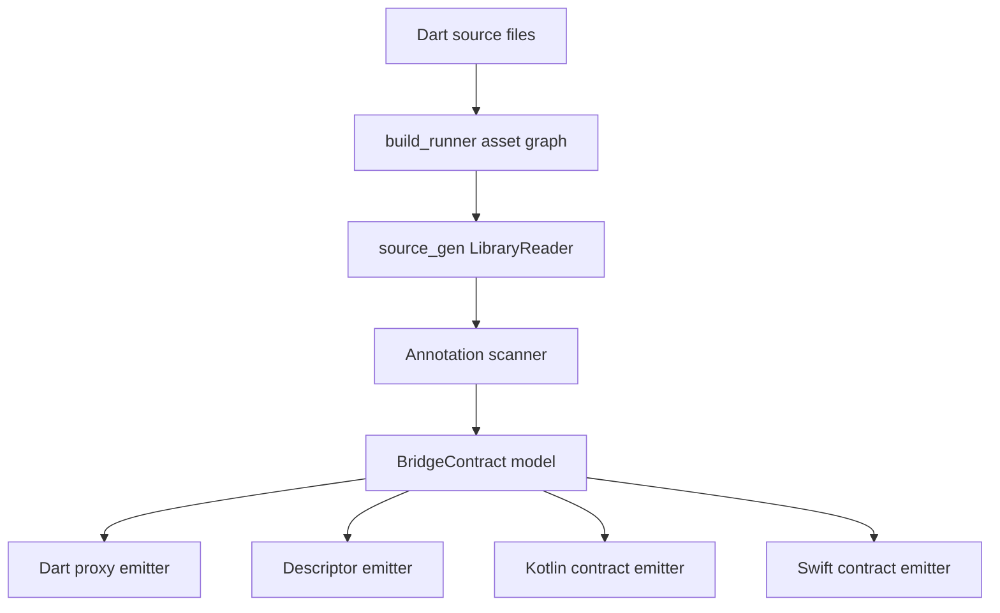

# Code generation pipeline

## Analyzer rules

The generator validates:

- `@Bridge` targets are abstract classes.
- Bridge operations are abstract instance methods.
- Stream operations return `Stream<T>`.
- Event stream operations do not currently accept parameters.

## Generated Dart

The Dart emitter creates:

- `BridgeDescriptor` constants for runtime registration and DevTools.
- private client implementations such as `_$PaymentBridgeClient`.
- method invocations through `BridgeClient.invoke<T>()`.
- event stream access through `BridgeClient.events<T>()`.

Application code owns the public abstraction. Generated code owns transport
binding.

## Native contracts

The first-generation emitter produces Kotlin and Swift protocol/interface
contracts as generated strings. The next step is a dedicated builder that writes
native files into platform source sets while keeping the Dart asset graph
incremental and deterministic.
