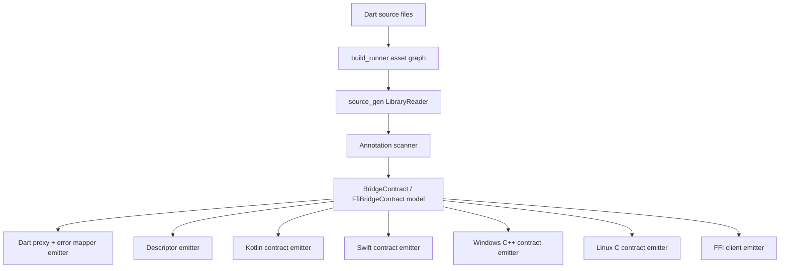

# Code generation pipeline

## Analyzer rules

The generator validates:

- `@Bridge` targets are abstract classes.
- Bridge operations are abstract instance methods.
- Stream operations return `Stream<T>`.
- Event stream operations do not currently accept parameters.
- `@BridgeError`-annotated classes are recognised and wired into a typed
  error mapper.

## Generated Dart

For every `@Bridge`-annotated class the generator emits:

- A `BridgeDescriptor` constant including codec, platforms, errors, and
  event replay / buffer settings.
- A private `_$YourBridgeClient` implementation that:
  - dispatches `@BridgeMethod(transport: …)` to either `BridgeClient.invoke`
    or `BridgeClient.send`,
  - applies per-method `timeout`s,
  - uses the declared `codec` (`json` / `identity` today),
  - builds a `BridgeErrorMapper` mapping each `@BridgeError(code)` to a
    typed Dart exception.
- A `_buildErrorMapper()` factory you can introspect from tests.

For every `@FFIBridge`-annotated class the generator emits:

- A `_$YourBridgeFfiDescriptor` map with library / symbol / threading metadata.
- A `_$YourBridgeClient` whose methods dispatch to a
  `Map<String, YourBridgeFfiHandler>` registered by the application.
- A `YourBridgeFfiHandler` typedef.

## Native contracts

Kotlin, Swift, Windows C++, and Linux C contracts are emitted as raw string
constants inside the same `.g.dart`. They:

- mirror every `@Bridge` method as `suspend fun` / `async throws` / virtual
  C++ method / function pointer,
- expose stream methods as Kotlin `Flow<T>` and Swift `AnyPublisher<T,Error>`,
- surface `@BridgeError(code)` codes as native constants (`object …Errors` /
  `enum …Errors`).

Writing the strings into the platform source sets is a post-1.0 roadmap
item; today consumers copy the constants into their `android/` / `ios/`
projects (or pipe them through their own codegen).
